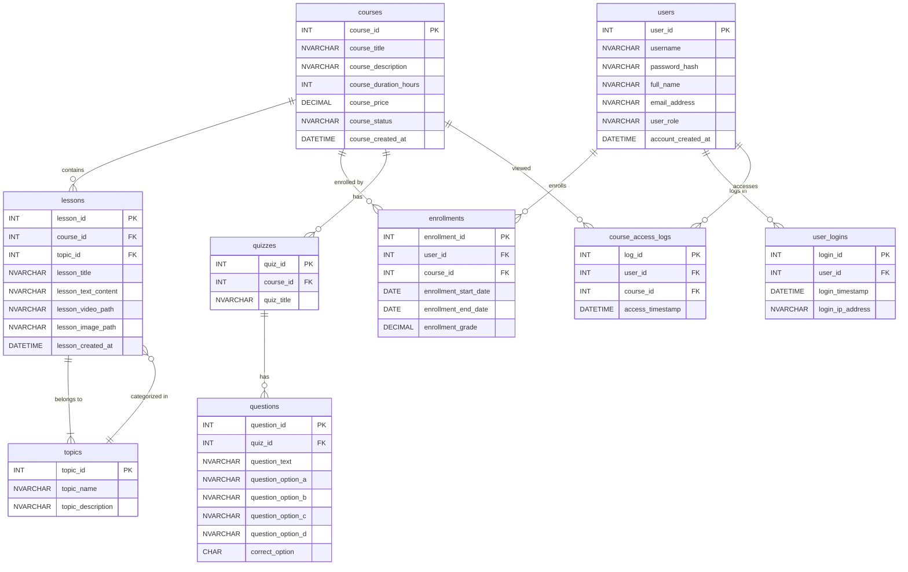

```mermaid
erDiagram
    users {
        INT user_id PK
        NVARCHAR username
        NVARCHAR password_hash
        NVARCHAR full_name
        NVARCHAR email_address
        NVARCHAR user_role
        DATETIME account_created_at
    }

    courses {
        INT course_id PK
        NVARCHAR course_title
        NVARCHAR course_description
        INT course_duration_hours
        DECIMAL course_price
        NVARCHAR course_status
        DATETIME course_created_at
    }

    topics {
        INT topic_id PK
        NVARCHAR topic_name
        NVARCHAR topic_description
    }

    lessons {
        INT lesson_id PK
        INT course_id FK
        INT topic_id FK
        NVARCHAR lesson_title
        NVARCHAR lesson_text_content
        NVARCHAR lesson_video_path
        NVARCHAR lesson_image_path
        DATETIME lesson_created_at
    }

    enrollments {
        INT enrollment_id PK
        INT user_id FK
        INT course_id FK
        DATE enrollment_start_date
        DATE enrollment_end_date
        DECIMAL enrollment_grade
    }

    quizzes {
        INT quiz_id PK
        INT course_id FK
        NVARCHAR quiz_title
    }

    questions {
        INT question_id PK
        INT quiz_id FK
        NVARCHAR question_text
        NVARCHAR question_option_a
        NVARCHAR question_option_b
        NVARCHAR question_option_c
        NVARCHAR question_option_d
        CHAR correct_option
    }

    user_logins {
        INT login_id PK
        INT user_id FK
        DATETIME login_timestamp
        NVARCHAR login_ip_address
    }

    course_access_logs {
        INT log_id PK
        INT user_id FK
        INT course_id FK
        DATETIME access_timestamp
    }

    users ||--o{ enrollments : "enrolls"
    users ||--o{ user_logins : "logs in"
    users ||--o{ course_access_logs : "accesses"

    courses ||--o{ lessons : "contains"
    courses ||--o{ enrollments : "enrolled by"
    courses ||--o{ quizzes : "has"
    courses ||--o{ course_access_logs : "viewed"

    topics ||--o{ lessons : "categorized in"

    quizzes ||--o{ questions : "has"

    lessons ||--|{ topics : "belongs to"
```